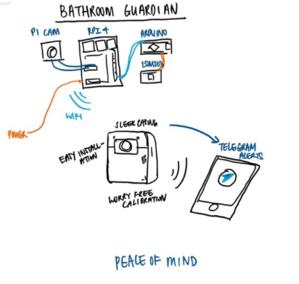
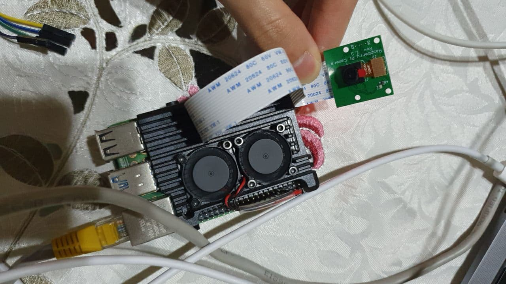
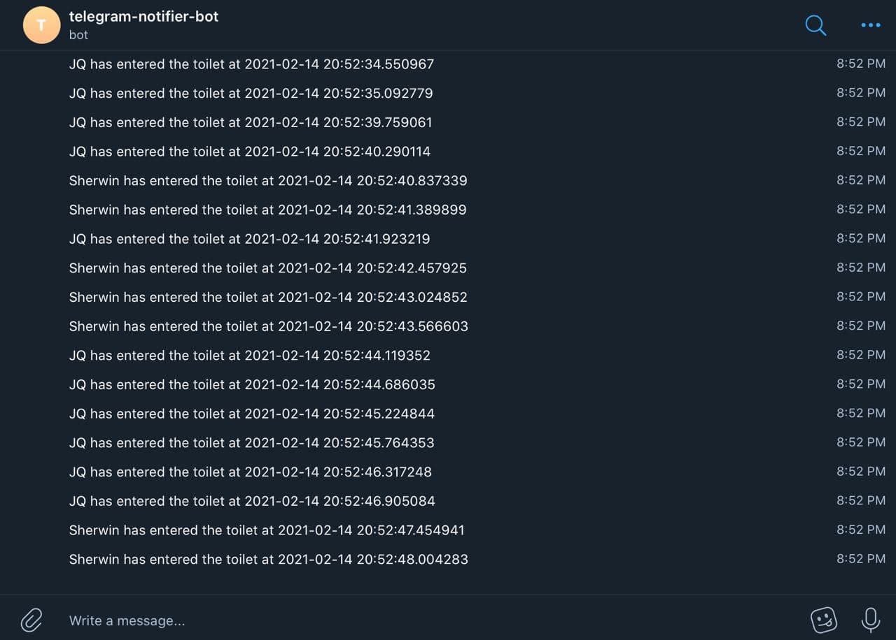

# Bathroom-Guardian

Bathroom Guardian, a system to alert trusted contacts if their vulnerable family members had been in the toilet for too long using Machine Learning and Sensors. 

Contributors: Sherwin Da Cruz, Jia Qi Poon, Tian Yi Lim, Si Yu Tan

## Primary Goal

The bathroom is one of the most commonly used places in the household but yet, statistics show that the bathroom can be the most dangerous room within the home. According to the New York Times, the Centers for Disease Control and Prevention have found that each year, approximately 235,000 people over the age of 15 visit emergency rooms because of injuries they suffered in the bathroom. About 14 percent of these individuals are hospitalized. The wet surface in the bathroom can easily lead to major falls and cause deadly injuries, especially for the elderly and vulnerable.  

There are many solutions offered to make the bathroom a safer place such as an anti-slip mat, safety grips. However, all these solutions are preventive measures and do not fully take the worry of people’s mind if an injury has actually happened in the bathroom. While households can install emergency pull cord alarms to allow the bathroom user to warn other household members if they are injured, the effectiveness of this depends on how accessible the cord is and if the bathroom user is still conscious. 

 
## Product Description

Our product is Human-centered Robotics application designed to make the lives of household members safer, with a target audience of households with vulnerable members such as the elderly and the disabled. It takes the worry of households that have vulnerable members by monitoring the usage of the bathroom and indicating to other members of the household if someone has been in the bathroom for too long. This allows quicker detection of injuries in the bathrooms. 

Here is the general diagram of the Bathroom Guardian:

## How it works

The product uses Raspberry Pi and has two main features, a computer vision component as well as physical electronics to detect whether the door is open or closed. The face recognition was done using opencv dnn to run a tensorflow model to detect faces and then inputting the detected faces through the LBPH face recognition algorithm to identify which household member has entered the toilet. The device then keeps track of how long they have been there. If that person has been in bathroom for too long, our device will alert a trusted contact via telegram. 

## Final thoughts about design 

Our design aims to make the home a safer environment for vulnerable persons such as the elderly, and give their caretakers peace of mind knowing our design would warn them if someone has potentially collapsed or had an accident while using the bathroom. 

## Future improvements 

Currently, our design is a rough idea of how it would work in theory. Some improvements could include a better model to detect faces, since the current model we are using is not very sensitive. A more sophisticated logic would make use of a microphone to determine if the user had been showering or not which would affect the threshold time before alerting someone. 

In addition, we would be able to further optimize the door open/closing detection of the system from using accelerometer data. We could perhaps use an Arduino Nano BLE Sense microcontroller to take advantage of the inbuilt accelerometer and its TinyML support, to better be able to detect and recognize events in the vicinty, reducing the chances of false alarms. 

 

## References

https://towardsdatascience.com/real-time-face-recognition-an-end-to-end-project-b738bb0f7348

https://github.com/spmallick/learnopencv/tree/master/FaceDetectionComparison